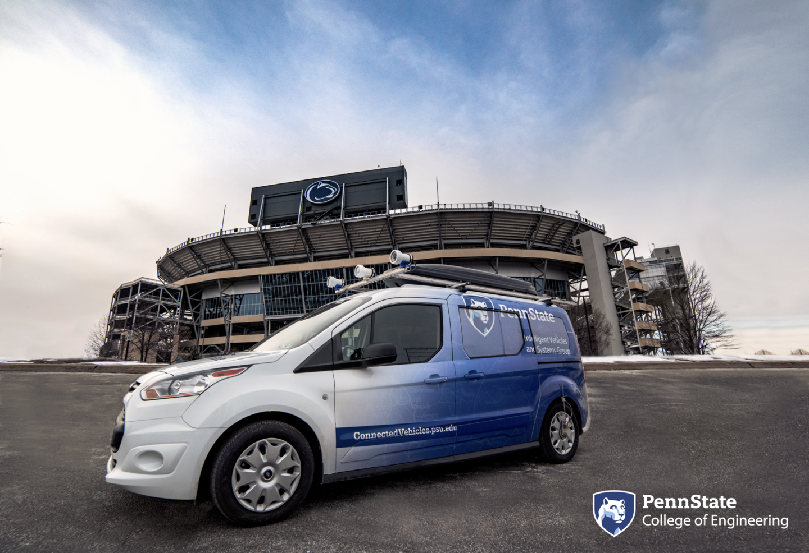

# Safe Integration of Automated Vehicles into Work Zones
In 2015 there were an estimated 96,626 crashes in work zones, an increase of 7.8 percent from 2014. This makes 2015 the second year in a row that work zone crashes rose after a low of 67,887 in 2013. In 2009, there were 667 work zone fatalities. Crashes in highway work zones have killed at least 4,700 Americans – more than two a day – and injured 200,000 in the last five years alone. There are more than 40,000 injuries in work zones each year. About 85 percent of people killed in work zones are motorists, not workers.

In Pennsylvania, the number of work zone crashes has steadily increased since 2007. Pennsylvania has also consistently appeared in the top 10 states with the most commercial motor vehicle related work zone crashes. Our project intends to improve safety in and around work zones for AVs by increasing identification and connectivity with work zone artifacts, improving visibility by coating pavement marking and work zone artifacts, and improving mapping of work zones.

# Project Vision, Mission, Goals, and Objectives
Vision – Enable automated vehicles to safely operate in work zones without human intervention.

Mission – Reduce traffic fatalities and increase mobility for all Americans in work zones through automated vehicles.

Goals – Achieve safe navigation of automated vehicles on par with non-distracted, humanoperated automated vehicles within work zones.

Objectives:
1. Evaluate the impact of improved connectivity between the AVs and the work zone artifacts using DSRC/C-V2X.
2. Evaluate the impact of increased visibility (machine vision) of pavement markings and work zone artifacts on AVs through innovative coatings
3. Evaluate the impact of providing high definition mapping of work zone artifacts (i.e. cones, barrels, workers, vehicles)
4. Improve the map information dissemination process from the mapping providers and/or infrastructure owners/operators to the AVs through standardization of digital mapping
information for work zones.

# Team members (WIP)
 
* Project PIs
  

  Dr. Sean Brennan  
  

 

 * Students

 Maddipatla Satya Prasad   |  Wushuang Bai             | Liming Gao                | Xinyu Cao
:-------------------------:|:-------------------------:|:-------------------------:|:-------------------------:
  |  |  |  

# Testing vehicle
* Penn State Mapping Vehicle
 

# Broader impacts(WIP)

# Groups with related interests(WIP)

# Equipment inventory (WIP)

# Funding
This project is funded by USDOT via Pennsylvania Department of Transportation under NOFO # 693JJ319NF00001.
